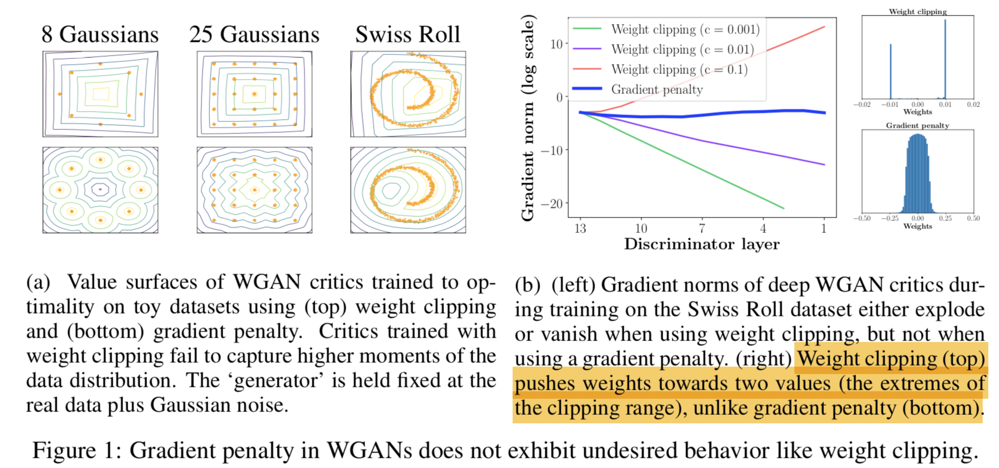

# Improved Training of Wasserstein GANs (WGAN-GP)
**Ishaan Gulrajani , Faruk Ahmed, Martin Arjovsky, Vincent Dumoulin, Aaron Courville**

[ [Paper](https://arxiv.org/abs/1704.00028) ]
[ [Code](https://github.com/igul222/improved_wgan_training.) ]

## 摘要

這篇針對 WGAN 的訓練提出改進，利用 gradient penalty 來限制 disriminator。
作者利用這樣的方式可以成功訓練多種架構的網路，並保有原先 WGAN 的收斂性質。
儘管這篇有比較多的數學推導，但也因此可以合理的解釋設計模型的原因，值得花時間閱讀。

## 將 GAN 改造成 WGAN
1. (WGAN) 訓練多次 discriminator，再訓練 generator
2. (WGAN) 損失函數計算 Wasserstein Loss 而非原先的 JS 散度(discriminator 太容易區分)
3. (WGAN-GP) discriminator 不要使用 batch normalization，可以使用 layer normalization。這是因為 batch normalization 將每個樣本含其他的樣本連結，但在 gradient penalty 的計算上每個樣本都是獨立計算的
4. (WGAN-GP) 移除 discriminator 輸出的 nonlinear activation

Discriminator Loss

## Weight Clipping 的問題
作者利用文中的推論一說明， weight clipping 會導致模型的 weight 傾向極端的分布，也就是接近被 clipping 的值，最終傾向產生簡單的模型，類似正規化 (regularization) 的效果。

## Gradient Penalty 的設計
根據 WGAN 的推導，必須要求 discriminator 要是 1-lipschitz function，也就是必須滿足每一點的 gradient norm 都要比 1 小，因此懲罰 gradient 大於 1 的情形(實際上是懲罰不為 1 的情形，作者比較過兩者後認為後者較佳)。另外，計算上只需要考慮到 data distribution 和 generator distribution 中間的點就好，除此之外的點不會在梯度下降的過程中走到。因此可以得到上面的損失函數

## WGAN-GP 在不同模型架構上的訓練
作者比較 WGAN, WGAN-GP, DCGAN 在各種不同架構上的訓練，並認為 gradient penalty 的方式可以不容易造成 model collapse，因此容易訓練出結果。作者也另外實驗在離散的輸出上訓練(例如 one-hot vector)，使用 WGAN-GP 也可以訓練。

