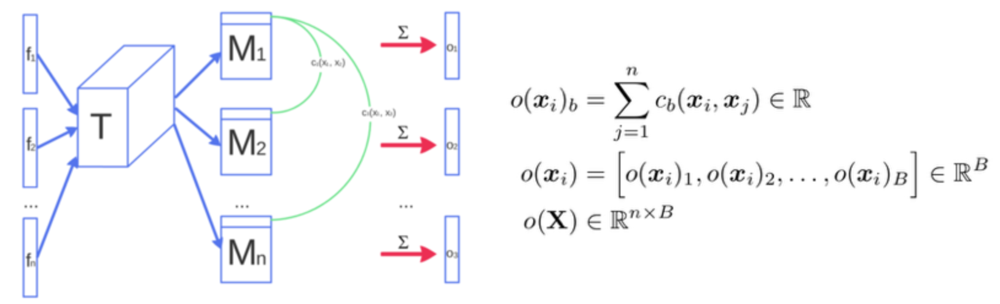

# Improved Techniques for Training GANs
**[OpenAI] Tim Salimans, Ian Goodfellow, Wojciech Zaremba, Vicki Cheung, Alec Radford, Xi Chen**

[ [Paper](https://arxiv.org/abs/1606.03498) ]
[ [Code](https://github.com/openai/improved-gan) ]

## 摘要
這篇就三個面向來討論 GAN，分別是：
1. 如何使訓練過程穩定：feature matching, minibatch discrimination, historical averaging, one-sided label smoothing, virtual batch normalization 
2. 如何評估訓練出來的結果：inception score
3. 如何將 GAN 應用在其他的問題上： semi-supervise training
儘管這篇提到的技巧沒有明顯的理論基礎，但是提出的幾種訓練方法以及評估的方式都在之後的研究中很常被採用。

## Feature matching
類似 patch discriminator，目的是希望避免 discriminator 過度的訓練，也就是不再只根據輸出的單一值判斷，而是根據中間層產生的 n*n patch 特徵，這樣不只可以避免 discriminator 在短時間變得過強，在其他的。另外在 [pixel2pixel](https://phillipi.github.io/pix2pix/) 也提到 patch 的大小與最後生成的結果的關係。

## Minibatch discrimination：
GAN 的訓練常常因為 model collapse 而失敗，其中一種結果就是 generator 無視輸入的隱變量生成完全相同的結果。作者提到在這種情形發生前，discriminator 在相近的點產生指向同一個地方的 gradient，導致產生相同的結果出現，因為訓練過程中每個樣本都是獨立的經過 discriminator，因此並沒有機制防止上述的情形。而這個方法的概念就在於訓練時將同一個 batch 不同資料的差異度也納入考量。**（作者提到在 batch normalization 在 GAN 上的成功，可以以這樣的想法解釋，不太懂這部份的意思，可能還需要進一步的閱讀相關的研究）**

<p align="center"></p>

```python
# Modified from 
# https://github.com/openai/improved-gan/blob/master/mnist_svhn_cifar10/nn.py
# https://github.com/AaronYALai/Generative_Adversarial_Networks_PyTorch/tree/master/ImprovedGAN
import torch
from torch import nn

class MinibatchLayer(nn.Module):
    def __init__(self, in_channels, num_kernels=100, dim_per_kernel=5):
        super(MinibatchLayer, self).__init__()
        self.T = nn.Parameter(torch.randn(in_channels, num_kernels, dim_per_kernel) * 0.1)
        self.n_B = num_kernels
        self.n_C = dim_per_kernel

    def cuda(self, device=None):
        super(MinibatchLayer, self).cuda(device)
        self.T = self.T.cuda(device)

    def forward(self, input):
        n = input.shape[0]
        input = input.view(n, -1)
        
        # input: n x n_A, T: n x n_A x n_B
        Ms = input.mm(T)
        Ms = Ms.view(n, self.n_B, self.n_C)
        abs_diff = (Ms.unsqueeze(dim=-1) - Ms.permute(1, 2, 0).unsqueeze(dim=0)).abs().sum(dim=2)
        abs_diff += torch.eye(n, n) * 1e-6
        # abs_diff: n x n_B x n
        minibatch = torch.sum(torch.exp(-abs_diff), dim=-1)

        # minibatch: n x n_B
        return torch.cat((input, minibatch), dim=1)
```

## Historical averaging
在 loss 加入參數和過往數值的平均差值

## One-sided label smoothing

## Virtual batch normalization

# Inception Score

# GAN in semi-supervise learning
